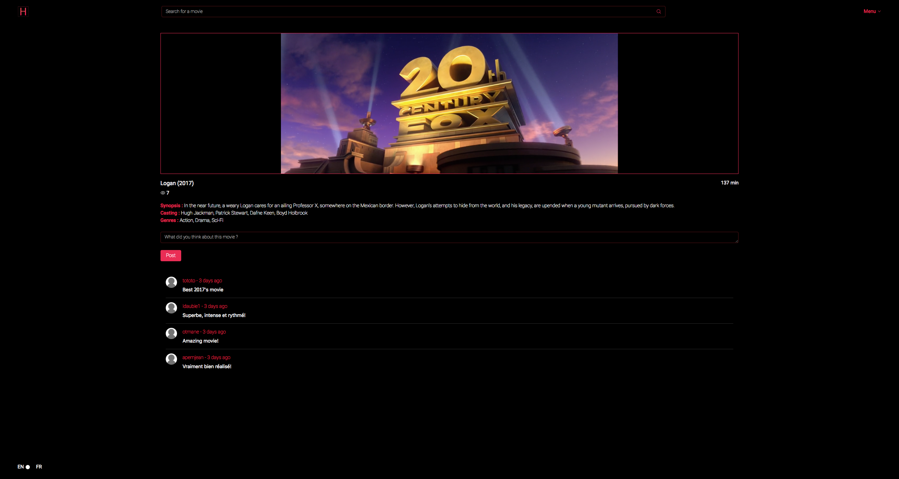

# 42-hypertube

Ecole 42 Paris group project.

## NodeJS + ReactJS/Redux application

Hypertube is a video streaming application created from scratch, where a user can browse through movies to be live streamed.

- See the documentation folder for complete informations about the application architecture and technologies.
- See the screenshots folder for more pictures of the application UI.

Signin Page:

Landing Page - recommendation:

Search Page - result:

Movie Page:

### WARNING:

THIS APPLICATION IS THE RESULT OF A SCHOOL PROJECT. IT'S PURPOSE WAS TO TEACH US ABOUT LIVE FILE STREAMING AND CONVERTION USING THE BIT TORRENT PROTOCOL. IT WAS NEVER MEANT TO RUN IN PRODUCTION AND WILL NEVER BE.

### Collaborators:
@atoulmet @abanvill